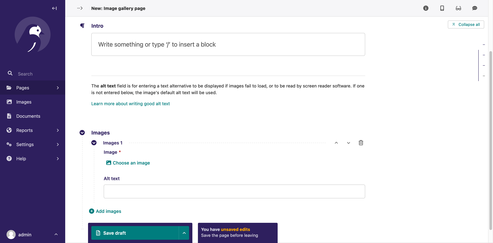

# Step Eight: Helping Editors Help Themselves

To close out the coding portion of our tutorial, we'll take a look at how we can provide more timely guidance to editors while they are creating their content.


## `help_text`

You probably noticed the `help_text` attribute that we included in our custom image block in the previous step. If you have experience in Django, this is probably a familiar concept for you, but help text is a way for developers to provide hints about a field to a user as they are editing it.

### Help text for alt text

Here again is the meat of our `ImageBlock` class:

```python
class ImageBlock(StructBlock):
    image = ImageChooserBlock()
    alt_text = CharBlock(
        required=False,
        help_text="Use to override the image's default alt text.",
    )
    decorative = BooleanBlock(
        required=False,
        help_text="If this image does not contain meaningful content or is described in nearby text, check this box to not output its alt text.",
    )
    # ...
```

Let's improve the help text on the `alt_text` field by adding additional context and a link to further guidance. We can include HTML in our help text by using Django's `mark_safe` utility. Add this import to the top of `blocks.py`:

```python
from django.utils.safestring import mark_safe
```

Then update the help text to something like this:

```python
    alt_text = CharBlock(
        required=False,
        help_text=mark_safe(
            "Enter a text alternative to be displayed if images fail to load, "
            "or to be read by screen reader software. "
            "(Overrides the image's default alt text.) "
            '<a href="https://www.a11yproject.com/posts/alt-text/" '
            'target="_blank">Learn more about writing good alt text</a>'
        ),
    )
```

This explains what the field actually does for users who might be unfamiliar with the term "alt text", and offers them a way to learn more about best practices for alt text.

### Help text for heading levels

Looking back at the `HeadingBlock`, let's add some help text to inform users about heading hierarchy considerations when choosing their heading level. Here is the original block again:

```python
class HeadingBlock(StructBlock):
    size = ChoiceBlock(
        choices=[
            ("h2", "H2"),
            ("h3", "H3"),
            ("h4", "H4"),
        ],
    )
    text = CharBlock()

    class Meta:
        icon = "title"
        template = "blocks/heading_block.html"
```

And here is an example of the kind of help text I would add to the `size` field:

```python
        help_text=mark_safe(
            'Please ensure that you do not skip heading levels. '
            'For example, the next heading after an H2 '
            'should only be either an H3 or another H2. '
            '<a href="https://www.a11yproject.com/posts/'
            'how-to-accessible-heading-structure/" target="_blank">'
            'Learn more about heading structure</a>'
        ),
```


## `HelpPanel`

Sometimes you might find yourself in a situation where it'd be a better user experience to give guidance at a page level rather than on individual fields.

For example, let's say you have an Image Gallery page type. In this situation, you probably wouldn't want to use our existing `ImageBlock` because each image in that context would never be decorative, so alt text should be required. And, if you're adding large, arbitrary number of images to the page, seeing identical help text on each of those fields would be noisy and redundant.

Wagtail has a `HelpPanel` that is perfect for this kind of situation. Rather than a typical editor panel that provides some sort of form widget for entering content, `HelpPanel` is a way to provide read-only help content to users.

Here's how we might define an image gallery page model and include a `HelpPanel` to provide alt text guidance in a single prominent location:

```python
from django.db import models

from wagtail.models import Page, Orderable
from wagtail.fields import RichTextField
from wagtail.admin.panels import FieldPanel, HelpPanel, InlinePanel
from wagtail.search import index

from modelcluster.fields import ParentalKey


class ImageGalleryPage(Page):
    intro = RichTextField(blank=True)

    content_panels = Page.content_panels + [
        FieldPanel("intro"),
        HelpPanel(
            content=(
                "<hr>"
                "<p>The <b>alt text</b> field is for entering a text alternative "
                "to be displayed if images fail to load, "
                "or to be read by screen reader software. "
                "If one is not entered below, the image's default alt text will be used.</p>"
                '<a href="https://www.a11yproject.com/posts/alt-text/" '
                'target="_blank">Learn more about writing good alt text</a>'
            )
        ),
        InlinePanel("gallery_images", label="Images"),
    ]


class ImageGalleryImage(Orderable):
    page = ParentalKey(
        ImageGalleryPage, on_delete=models.CASCADE, related_name="gallery_images"
    )
    image = models.ForeignKey(
        "custom_media.CustomImage", on_delete=models.CASCADE, related_name="+"
    )
    alt_text = models.CharField(blank=True, max_length=250)

    panels = [
        FieldPanel("image"),
        FieldPanel("alt_text"),
    ]
```

If you want to try it out, copy and paste the above code into your `blog/models.py` file and create a new `ImageGalleryPage` under your home page.

This results in a neat and tidy interface for building an image gallery:



We didn't include a template for this page, but you're welcome to try adding one. Here are a couple hints:

1. Put it at `myblog/templates/blog/image_gallery_page.html`, which follows the conventional Wagtail template location pattern so you don't have to specify the template location in the model.
2. We left off the decorative checkbox because images in a gallery context should always have alt text. Refer back to our original implementation of `image_block.html` to see how you could use a simple `if`/`else` statement to determine which alt text to output.

(As a brief aside, the `ImageGalleryPage` model also showcases a common Wagtail pattern you might want to be aware of – the use of an `InlinePanel` to insert any number of standard Django model fields – or combinations of fields, like this example with both an image and its alt text – without using a StreamField. You can [read more on inline models in the docs](https://docs.wagtail.org/en/stable/topics/pages.html#inline-models).)


---

That's the end of our coding for this tutorial! Thanks for joining us :) If you want to see what else you can do with your starter project, visit [Next Steps](https://github.com/vossisboss/djangoconwagtail2024/tree/next-steps).
